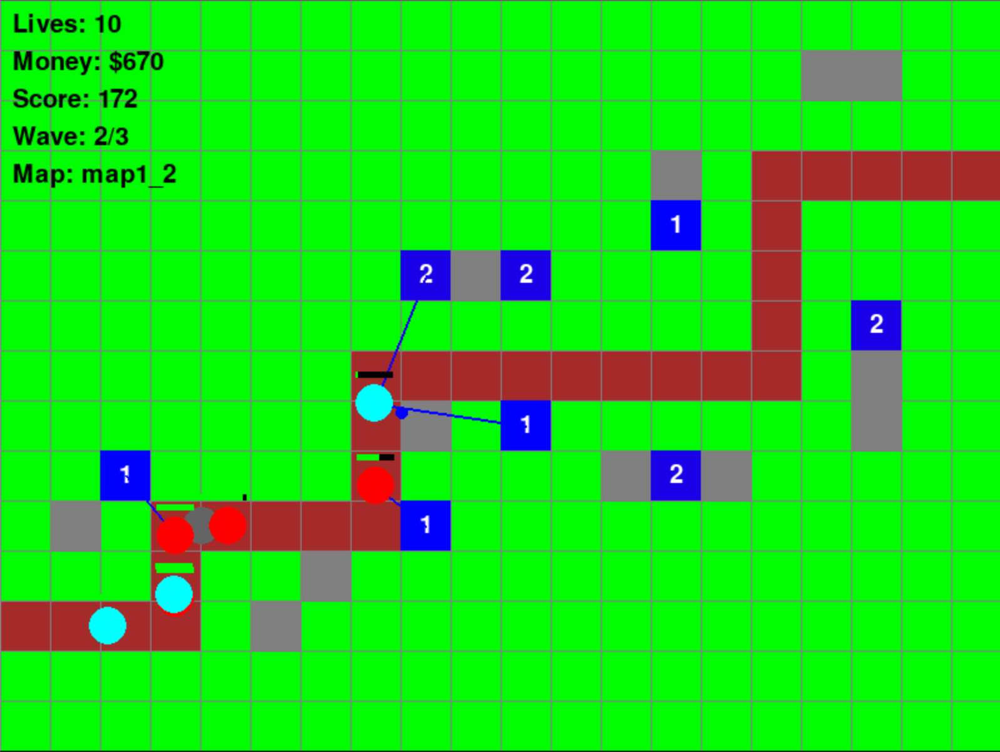

# Strategic Generalization in Tower Defense: A PPO+LSTM Approach

> A PPO+LSTM agent with curriculum learning that develops transferable defensive strategies across unseen map configurations — no hand-crafted heuristics, no hardcoded rules.

[](https://python.org)
[](https://pytorch.org)
[](https://pygame.org)



---

## Table of Contents

- [Why This Architecture](#why-this-architecture)
- [What Changed From the DQN Approach](#what-changed-from-the-dqn-approach)
- [Architecture](#architecture)
- [Reward Engineering](#reward-engineering)
- [Results](#results)
- [Project Structure](#project-structure)
- [How to Run](#how-to-run)
- [References](#references)

---

## Why This Architecture

Tower defense isn't just a spatial problem — it's a *temporal* one. A tower placed 50 steps ago changes what the optimal action is now. Wave patterns evolve, resources accumulate, and defensive gaps only reveal themselves when enemies arrive. Solving this requires three capabilities working together:

**Temporal memory** — The agent needs to remember what it built, what waves it faced, and how its resource allocation evolved over the course of a game. An LSTM maintains hidden state across timesteps within each episode, giving the agent access to its full decision history.

**Stable policy learning** — In a complex action space (61 discrete actions across placement, upgrade, and wait decisions), small changes to the policy can cascade into completely different strategies. PPO's clipped surrogate objective constrains update magnitude, preventing the destructive policy swings that destabilize learning.

**Progressive difficulty** — Complex multi-path maps are unsolvable without first understanding fundamentals on simpler layouts. Our curriculum orders 10 maps by complexity, requiring mastery before advancement. Knowledge transfers through preserved network weights and the strategic position abstraction layer.

## What Changed From the DQN Approach

| | DQN | PPO+LSTM |
|---|---|---|
| **Core issue** | Q-value overestimation — agent became confident in bad strategies | Clipped policy updates prevent overconfident convergence |
| **Temporal reasoning** | None — each frame processed independently | LSTM hidden state persists across episode |
| **Map exposure** | Random — hard maps before mastering easy ones | Curriculum with mastery gates |
| **Action evaluation** | Indirect (Q-values estimate future reward) | Direct policy optimization |
| **Result** | Declining performance despite 800 episodes | Perfect scores on 4/10 maps, 3 full curriculum cycles in 100 episodes |

## Architecture

```
Grid State (4ch x 20x15)  -->  CNN [Conv2d x3]  -->  Flatten
                                                        \
                                                         Combine --> LSTM (256 hidden) --> Actor Head (61 actions)
                                                        /                               --> Critic Head (1 value)
Scalar State (4-dim)       -->  FC (64)          -->  ...
```

The CNN processes spatial relationships (where are towers, paths, enemies on the grid), the LSTM captures temporal context (what has the agent done so far this episode), and the actor-critic heads separate action selection from state evaluation. The LSTM hidden state resets between episodes but persists within them — the agent remembers its entire build history during a game.

**Curriculum structure:**
```
map1_0 --> map1_1 --> map1_2 --> ... --> map1_6 --> map2_0 --> map2_1 --> map2_2
 (simple single-path)                                    (complex multi-path)
```
The agent must complete each map successfully multiple times before advancing. After reaching map2_2, the curriculum cycles back, reinforcing fundamental strategies.

## Reward Engineering

The reward function is a critical design element — not a simple game score. Five components shape specific strategic behaviors:

```
R_total = R_action + R_game + R_wave + R_tower + R_time
```

**Position-weighted placement and upgrades** — Close-to-path actions earn 1.5x multiplier, medium 1.0x, far 0.7x. This intrinsically guides the agent toward choke points without hardcoding "place towers here."

**Tower firing activity tracking** — Towers that never fire get penalized proportional to their upgrade level and path proximity. This is what prevents "dead tower" strategies — the agent learns that placement only matters if the tower actually engages enemies.

**Scaled wave progression** — `150 + (wave_number x 30)` makes later waves worth significantly more, pushing the agent to build sustainable defenses rather than optimizing only for wave 1.

## Results

### Perfect Scores on Multiple Maps


The agent achieved perfect success rates (1.0) on 4 out of 10 maps, with mid-curriculum maps consistently above 0.85. Three complete curriculum cycles through all 10 maps in just 100 episodes — repeatedly advancing from simple to complex configurations and back.

### The Agent Discovered Optimal Positioning On Its Own


69% of all actions were medium-distance tower placements. This wasn't programmed — the agent independently discovered that medium positions offer the best coverage-to-cost ratio. It also learned to upgrade more against boss enemies (0.18 upgrade rate) than normal enemies (0.16), adapting its resource allocation to enemy characteristics.

### CNN and LSTM Dynamically Share the Load


The CNN and LSTM alternate as dominant contributors depending on the tactical situation. Spatial reasoning (CNN) dominates when positioning matters. Temporal reasoning (LSTM) takes over when responding to wave patterns and managing build sequences. This dynamic switching emerged naturally from training.

### Curriculum Learning Enables Knowledge Transfer


The staircase pattern shows the agent advancing through all 10 maps, cycling back to reinforce fundamentals, then progressing again. Each cycle through the curriculum was faster than the previous one — evidence that strategic knowledge accumulated rather than being forgotten.

### Clean Exploration-to-Exploitation Transition


Entropy dropped from 3.5-4.0 to ~0.5 by episode 40, with sustained low-level fluctuations afterward. The agent settled into effective strategies while maintaining enough exploration to adapt when encountering new maps.

## Project Structure

```
├── game.py                  # Tower defense environment (Enemy, Tower, Projectile, GameManager)
├── ppo_lstm_agent.py        # PPO+LSTM actor-critic network and agent
├── sequential_ppo_train.py  # Training loop with curriculum learning
├── maps.py                  # Map configurations (10 maps, simple to complex)
├── main.py                  # Entry point
└── assets/                  # Graphs and figures for README
```

## How to Run

```bash
# Install dependencies
pip install torch pygame numpy

# Train the agent with curriculum learning
python main.py

# Or run the sequential training directly
python sequential_ppo_train.py
```

## References

- Schulman et al. (2017) — [Proximal Policy Optimization Algorithms](https://arxiv.org/abs/1707.06347)
- Hochreiter & Schmidhuber (1997) — Long Short-Term Memory
- Berner et al. (2019) — [Dota 2 with Large Scale Deep RL](https://arxiv.org/abs/1912.06680) (OpenAI Five)
- Vinyals et al. (2019) — [Grandmaster Level in StarCraft II](https://www.nature.com/articles/s41586-019-1724-z) (AlphaStar)
- Narvekar et al. (2020) — [Curriculum Learning for RL Domains](https://jmlr.org/papers/v21/20-212.html)
